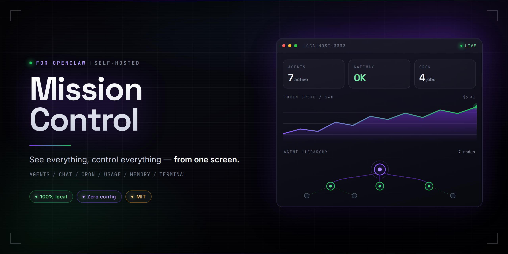

# Mission Control（ミッションコントロール）

[English](README.md) | [中文](README.zh-CN.md) | **日本語**

**[OpenClaw](https://github.com/openclaw) の司令塔。すべてを見て、すべてを操る、ひとつの画面から。**

AI エージェントをリアルタイムで監視。チャットで対話。ジョブをスケジュール。コストを追跡。メモリを管理。すべてブラウザで、すべてあなたのマシン上で。

## 気に入ったら、コーヒー（または Claude Code サブスク）をおごってください！
[](https://www.buymeacoffee.com/robsanna)

---

## なぜ Mission Control？

**ターミナルの窓を行き来するのはもう終わり。** OpenClaw を使っているなら、その力はご存知のはず。Mission Control は全体像を映します —— エージェントが何をしているか、いくら使っているか、システムは健全か。すべてを一箇所で。

**データはあなたのマシンから出ません。** Mission Control は 100% ローカルで動作。クラウドなし、テレメトリなし、アカウント登録なし。すでにあなたのマシンで動いている OpenClaw を覗く「窓」にすぎません。

**すぐに使えます。** インストールしてブラウザを開くだけ。Mission Control は OpenClaw 環境を自動検出 —— 設定ファイルもデータベース構築も不要です。

---

## 「薄いレイヤー」の哲学

Mission Control は独立したプラットフォームでは**ありません**。あなたのデータを保存せず、「真実の情報源」になろうともしません。

OpenClaw への**透明な窓**です。画面上のすべての数字とステータスは、稼働中の OpenClaw からリアルタイムで届きます。Mission Control で行った変更は、そのまま OpenClaw に反映されます —— 同期遅延も古いキャッシュもありません。（Mission Control 自身が持つのは、使用量履歴とカンバンボードというごく小さなローカルファイルのみ。OpenClaw データのコピーは一切持ちません。）

**あなたにとっての意味：**
- **常に正確** —— 見えているものが、いま起きていること
- **メンテナンス不要** —— DB マイグレーションもバックアップスクリプトも無し
- **壊れようがない** —— Mission Control が落ちても、エージェントは動き続ける

車のダッシュボードと同じです。速度・燃料・エンジン状態を表示しますが、外しても車は走ります。

---

## できること

### ひと目で全体を把握
**ダッシュボード**を開いた瞬間、ライブの全体像が見えます —— 稼働中のエージェント、ゲートウェイの健全性、実行中のクーロンジョブ、システムリソース（CPU・メモリ・ディスク）。

### エージェントと話す
**チャット**でブラウザから直接エージェントと会話。ファイル添付、モデル選択、ストリーミング応答。エージェントを切り替えてもコンテキストは失われません。

### 仕事を視覚的に整理
**タスク**は内蔵カンバンボード（Backlog / In Progress / Review / Done）。カードをドラッグして進捗を管理。

### 何でもスケジュール
**クーロンジョブ**で「毎朝受信箱を要約」のような定期タスクを設定。作成・編集・一時停止・テスト、実行履歴も完備。

### コストを把握
**使用量**がすべてのモデル・エージェントのトークンを追跡。グラフでコストの内訳を表示、予算を溶かしているエージェントがすぐ分かります。

### エージェントチームの管理
**エージェント**は組織図として全エージェントを表示 —— 誰がアクティブか、どのチャネルに接続しているか。サブエージェントの起動・停止もその場で。

### メモリを鋭く保つ
**メモリ**で長期記憶と日誌を表示・編集。**ベクトル検索**でセマンティックメモリを瞬時に検索。

### モデルとキーの管理
**モデル**で利用可能な AI モデル、プロバイダー認証、フォールバックチェーン、エージェントごとのモデル切り替えを一元管理。設定ファイルの手編集は不要。

### 健全性の監視
**ドクター**が診断を実行し、問題箇所をワンクリック修正付きで表示。**ゲートウェイ**の状態は常に見えます。

### 内蔵ターミナル
**ターミナル**はダッシュボード内のフル機能コマンドライン —— 複数タブ、カラー対応。

### メッセージングとつながる
**チャネル**で Telegram・Discord・WhatsApp・Signal・Slack との接続を設定。QR コードペアリング対応。

### ファイルを閲覧
**ドキュメント**でワークスペースの全ファイルを閲覧。**検索**（`Cmd+K`）で即座にセマンティック検索。

### セキュリティ
**セキュリティ**が設定を監査して問題を指摘。**権限**でエージェントの実行可能な操作を制御。**アカウントとキー**で認証情報を一元管理。

### リモートから
**Tailscale** 統合で、どこからでも安全にダッシュボードとエージェントへアクセス。

### クラッシュに強い
すべてのセクションが**エラーバウンダリ**で保護 —— ひとつのビューに問題が起きても、他は動き続けます。

---

## クイックスタート

### 1. OpenClaw のインストールを確認

```bash
curl -fsSL https://openclaw.ai/install.sh | bash
openclaw --version
```

### 2. Mission Control をインストール

```bash
cd ~/.openclaw
git clone https://github.com/robsannaa/openclaw-mission-control.git
cd openclaw-mission-control
./setup.sh
```

以上です。ブラウザで `http://localhost:3333` を開いてください。

**その他の起動方法：**

```bash
# ポートを変更
PORT=8080 ./setup.sh

# 開発モード（バックグラウンドサービスなし）
./setup.sh --dev --no-service

# 手動モード
npm install && npm run dev
```

> **設定ゼロ。** Mission Control は `~/.openclaw` ディレクトリと `openclaw` コマンドを自動検出します。

### エージェントにインストールさせる

すでに OpenClaw エージェントと話していますか？こう頼むだけ：

```
Mission Control をインストールして。リポジトリはここ：
https://github.com/robsannaa/openclaw-mission-control
```

---

## リモートアクセス

OpenClaw をサーバーで動かしている場合、SSH トンネルでアクセス：

```bash
ssh -N -L 3333:127.0.0.1:3333 user@your-server
```

ローカルで `http://localhost:3333` を開きます。

---

## 環境変数（任意）

すべて自動検出されますが、必要なら上書きできます：

| 変数 | デフォルト | 説明 |
|---|---|---|
| `OPENCLAW_HOME` | `~/.openclaw` | OpenClaw データの場所 |
| `OPENCLAW_BIN` | 自動検出 | `openclaw` コマンドのパス |
| `OPENCLAW_WORKSPACE` | 自動検出 | デフォルトワークスペース |
| `OPENCLAW_TRANSPORT` | `auto` | ゲートウェイ接続方式：`auto`・`http`・`cli` |
| `OPENCLAW_GATEWAY_URL` | `http://127.0.0.1:18789` | ゲートウェイアドレス（リモート構成用） |
| `OPENCLAW_GATEWAY_TOKEN` | _（空）_ | ゲートウェイ HTTP 認証トークン |

---

## FAQ

<details>
<summary><strong>「OpenClaw not found」と表示されたら？</strong></summary>

まずターミナルで `openclaw --version` が動くことを確認。動くのにダッシュボードがエラーを出す場合は、パスを直接指定：

```bash
OPENCLAW_BIN=$(which openclaw) npm run dev
```

OpenClaw 未インストールなら[こちらから](https://docs.openclaw.ai/install)。
</details>

<details>
<summary><strong>データはどこかに送信されますか？</strong></summary>

Mission Control 自身は何も送信しません —— 統計もトラッキングもなし。ネットワーク通信は、あなたが設定したものだけ：OpenClaw ゲートウェイと、あなたが選んだ AI モデルプロバイダー（完全ローカルモデルも選択可）。
</details>

<details>
<summary><strong>複数の OpenClaw 環境で使えますか？</strong></summary>

はい、別のインストールを指定するだけ：

```bash
OPENCLAW_HOME=/path/to/other/.openclaw npm run dev -- --port 3001
```
</details>

<details>
<summary><strong>ポートが使用中？</strong></summary>

```bash
npm run dev -- --port 8080
```
</details>

---

## コントリビュート

Pull Request 歓迎。バグや提案は [issue へ](https://github.com/robsannaa/openclaw-mission-control/issues)。

---

## ライセンス

MIT
